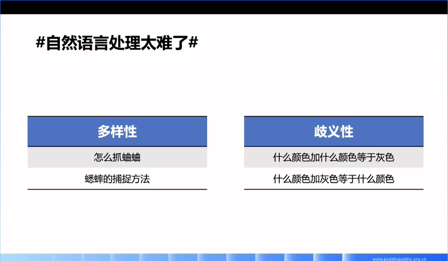
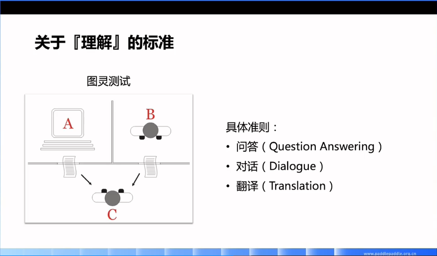
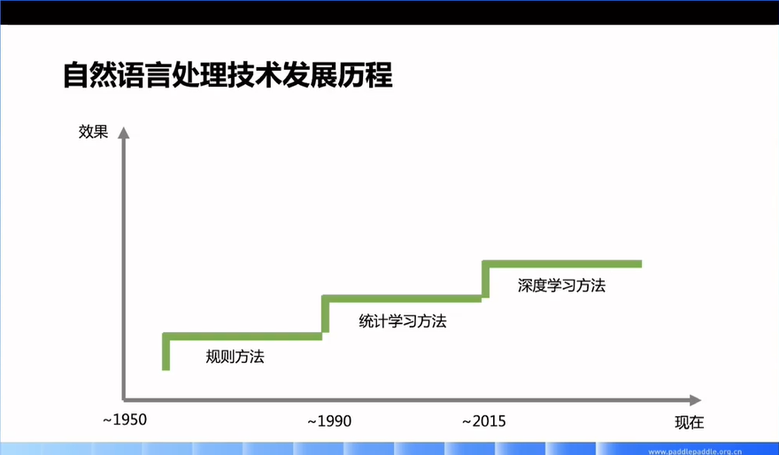
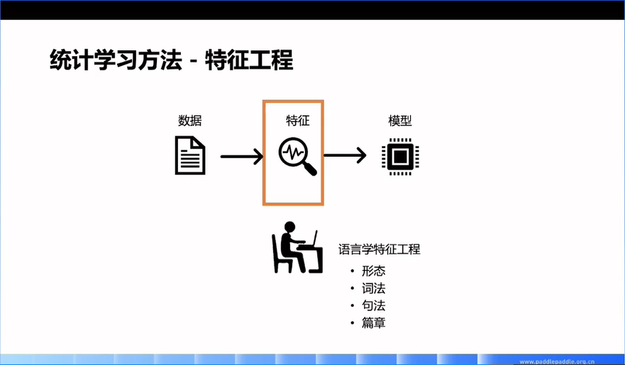

# 01 走进自然语言处理

- 直播日期：2021.06.07
- 主讲人：刘璟

## 直播大纲
- [什么是自然语言处理](#1)
- [自然语言处理的应用](#2)
- [自然语言处理的挑战](#3)
- [自然语言处理的技术发展](#4)
- [课程大纲、目标和形式](#5)

## 课件及笔记
<h3 id="1">1. 概念</h3>

- 特点1：让机器能够**自动理解**语言从而更好地实现人与计算机之间的交互

- 特点2：**综合/交叉**学科（语言学+计算机科学+数学）

<h3 id="2">2. 应用</h3>

#### 2.1 智能问答（Intelligent Question Answering System）：搜索引擎

- PC时代：在搜索引擎中键入问题 -> 获取结果 -> 依次点开查看每个结果 -> 判断答案是否满足需求
- 近些年：随着智能设备（智能手机、智能音箱等）的出现，其**小屏化甚至无屏化**的特点对NLP提出更高技术要求，即**机器能否在海量数据中在第一位就可以返回精准答案**
- **多模态**发展：文本问答，表格问答，视频问答等

#### 2.2 智能对话（Intelligent Dialogue System）：帮助用户更好更快地完成应用

- 案例：咖啡店中由机器人自动处理订单 [[详情见media文件夹中1_nlp_application_IntelligentDialogue.mp3文件]](../media/1_nlp_application_IntelligentDialogue.mp3)

#### 2.3 机器同传（Automatic Simultaneous Interpretation System）：可应用于外语会议，外国影视等

- 案例：外文视频机器同传（英译中） [[详情见media文件夹中1_nlp_application_AutomaticSimultaneousInterpretation.mp4文件]](../media/1_nlp_application_AutomaticSimultaneousInterpretation.mp4)
- 机器同传助手：https://tongchuan.baidu.com

<h3 id="3">3. 挑战</h3>

#### 3.1 自然语言的多样性与歧义性

- 多样性：文字没有交集，但语义相同
- 歧义性：文字有交集，但语义不同

#### 3.2 关于“理解”的标准——图灵测试（Turing Test）

图灵测试一词来源于计算机科学和密码学的先驱艾伦·麦席森·图灵写于1950年的一篇论文《计算机器与智能（Computing Machinery and Intelligence）》，其中30%是图灵对2000年时的机器思考能力的一个预测，目前我们已远远落后于这个预测。其具体是指**测试者与被测试者（一个人和一台机器）隔开的情况下，通过一些装置（如键盘）向被测试者随意提问。进行多次测试后，如果机器让平均每个参与者做出超过30%的误判，那么这台机器就通过了测试，并被认为具有人类智能。(《Turing's Responses to Two Objections》)**（来源：[百度百科-图灵测试词条](https://baike.baidu.com/item/%E5%9B%BE%E7%81%B5%E6%B5%8B%E8%AF%95/1701255)）

对应图例：人类C向被测试者（机器A&人类B）提出任务要求，如果C无法判断反馈中哪个是机器A的回答、哪个是人类B的回答，则机器A通过图灵测试。

<h3 id="4">4. 技术发展</h3>

- 20世纪50年代：计算机刚刚被发明出来，人们设想利用计算机的算力自动翻译国外资料，由于技术所限，最终只实现了**基于规则**的自动翻译系统，标志着NLP的**开端**
- 20世纪90年代：90年代初，IBM推出了世界上第一个统计型翻译系统，自此**统计学习方法**在NLP中成为主流方法
- 2015年：**基于深度学习**的机器翻译系统超过基于统计的机器翻译系统，自此**深度学习方法**在NLP中成为主流方法。深度学习方法不仅带来了**技术效果**上的提升，而且**开发效率**也有很大提升
- 统计学习方法 VS 深度学习方法
  - 统计学习方法：特征工程
    
    
    
    - 特点：需要由专家根据经验以及对任务的理解去撰写各种任务相关的特征，然后由机器根据各种特征从有监督数据中进行学习和训练，最终得到任务相关的模型
    - 弊端：依赖专家支持
  - 深度学习方法
