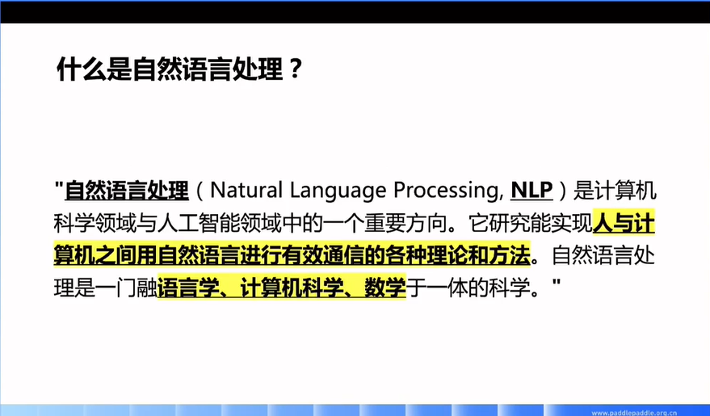
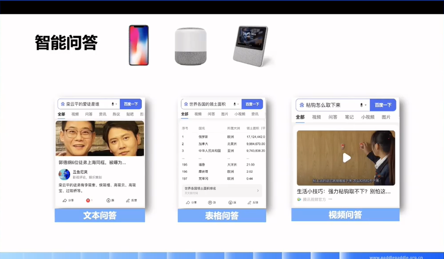

# 01 走进自然语言处理

- 直播日期：2021.06.07
- 主讲人：刘璟

## 直播大纲
- [什么是自然语言处理](#1)
- [自然语言处理的应用](#2)
- [自然语言处理的挑战](#3)
- [自然语言处理的技术发展](#4)
- [课程大纲、目标和形式](#5)

## 课件及笔记
<h3 id="1">概念</h3>

特点1：让机器能够**自动理解**语言从而更好地实现人与计算机之间的交互

特点2：**综合/交叉**学科（语言学+计算机科学+数学）

<h3 id="2">应用</h3>

智能问答（Intelligent question answering system）

智能对话

机器同传
