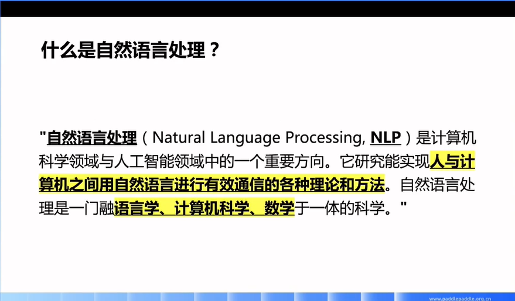
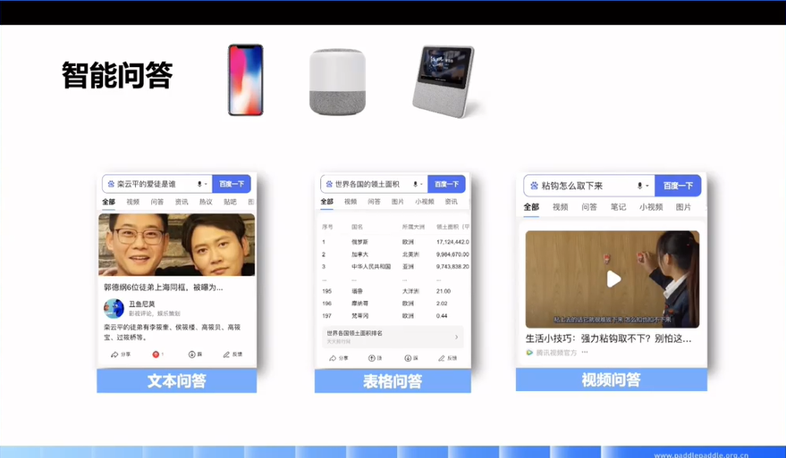

# 01 走进自然语言处理

- 直播日期：2021.06.07
- 主讲人：刘璟

## 直播大纲
- [什么是自然语言处理](#1)
- [自然语言处理的应用](#2)
- [自然语言处理的挑战](#3)
- [自然语言处理的技术发展](#4)
- [课程大纲、目标和形式](#5)

## 课件及笔记
<h3 id="1">1. 概念</h3>

- 特点1：让机器能够**自动理解**语言从而更好地实现人与计算机之间的交互

- 特点2：**综合/交叉**学科（语言学+计算机科学+数学）

<h3 id="2">2. 应用</h3>

- 智能问答（Intelligent question answering system）：搜索引擎

  

  - PC时代：在搜索引擎中键入问题 -> 获取结果 -> 依次点开查看每个结果 -> 判断答案是否满足需求
  
  - 近些年：随着智能设备（智能手机、智能音箱等）的出现，其**小屏化甚至无屏化**的特点对NLP提出更高技术要求，即**机器能否在海量数据中在第一位就可以返回精准答案**

  - **多模态**发展：文本问答，表格问答，视频问答等

- 智能对话：帮助用户更好更快地完成应用

  案例：咖啡店中由机器人自动处理订单
  
  <audio id="audio" controls="" preload="none">
      <source id="mp3" src="../media/1_nlp_application_IntelligentQA_Cafe.mp3">
  </audio>
  
  ddd

- 机器同传
